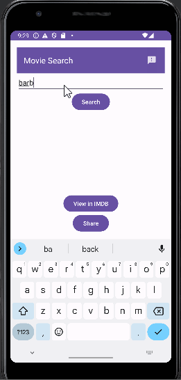

# Movie Search App

App where users can input text which will return a movie with stuff like its genre, IMDB rating, runtime, etc.

## Functionality 

The following **required** functionality is completed:

* [ ] User can input text and search for a movie. 
* [ ] User can share the IMDB link of a movie.
* [ ] Feedback button which will compose an email to the developer.

The following **extensions** are implemented:

* Retrofit
* Glide

## Video Walkthrough

Here's a walkthrough of the program:

GIF created with [LiceCap](http://www.cockos.com/licecap/).

## Notes

It was tricky to work with Retrofit but once we realized the request output was sent to Logcat, it was much easier to deal with.

## License

    Copyright [2023] [Tip Browne, Ethan Deporter]

    Licensed under the Apache License, Version 2.0 (the "License");
    you may not use this file except in compliance with the License.
    You may obtain a copy of the License at

        http://www.apache.org/licenses/LICENSE-2.0

    Unless required by applicable law or agreed to in writing, software
    distributed under the License is distributed on an "AS IS" BASIS,
    WITHOUT WARRANTIES OR CONDITIONS OF ANY KIND, either express or implied.
    See the License for the specific language governing permissions and
    limitations under the License.
